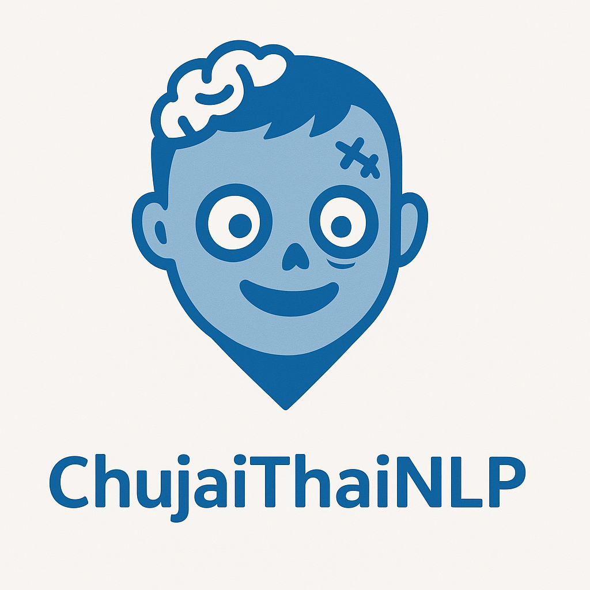

# ChujaiThaiNLP: Advanced Thai Natural Language Processing

<div align="center">
  
  <br>
  <a href="https://github.com/JonusNattapong/ChujaiThainlp/blob/main/LICENSE"></a>
  <a href="https://github.com/JonusNattapong/ChujaiThainlp/stargazers"></a>
  <a href="https://github.com/JonusNattapong/ChujaiThainlp/releases"></a>
</div>

**ChujaiThaiNLP** คือไลบรารีประมวลผลภาษาธรรมชาติที่ออกแบบเฉพาะสำหรับภาษาไทย พร้อมความสามารถในการทำงานกับหลายโมดัล (multimodal) เพื่อรองรับการผสมผสานข้อความ เสียงพูด ภาพ และอื่นๆ อย่างไร้รอยต่อ

## 🌟 คุณสมบัติ

### ความสามารถหลักด้าน NLP

- **การตัดคำ (Tokenization)**: การตัดคำภาษาไทยด้วยเทคโนโลยีล่าสุด
- **การรู้จำชื่อเฉพาะ (Named Entity Recognition)**: ระบุและจำแนกเอนทิตีในข้อความภาษาไทย
- **การวิเคราะห์ความรู้สึก (Sentiment Analysis)**: วิเคราะห์อารมณ์และความรู้สึกในเนื้อหาภาษาไทย
- **การตอบคำถาม (Question Answering)**: ค้นหาคำตอบจากเอกสารและตารางภาษาไทย
- **การสร้างข้อความ (Text Generation)**: สร้างข้อความภาษาไทยที่ลื่นไหลและเป็นธรรมชาติ
- **การแปลภาษา (Translation)**: แปลจากและเป็นภาษาไทย
- **การสรุปความ (Summarization)**: สร้างบทสรุปกระชับจากเอกสารภาษาไทย

### การประมวลผลแบบหลายโมดัล (Advanced Multimodal Processing)

- **เสียง-ข้อความ (Audio-Text)**: ถอดความและแปลเสียงพูดทั้งภาษาไทยและภาษาอื่นๆ
- **ภาพ-ข้อความ (Image-Text)**: สกัดข้อความจากภาพ (OCR), สร้างคำบรรยายภาพ, วิเคราะห์เนื้อหาภาพ
- **การตอบคำถามจากภาพ (Visual Question Answering)**: ตอบคำถามเกี่ยวกับเนื้อหาในภาพ
- **การเข้าใจเอกสาร (Document Understanding)**: ประมวลผลและสืบค้นเอกสารซับซ้อนพร้อมเข้าใจโครงสร้าง
- **การประมวลผลวิดีโอ (Video Processing)**: ถอดความและสรุปเนื้อหาวิดีโอ
- **การแปลงระหว่างโมดัล (Modality Conversion)**: แปลงระหว่างโมดัลต่างๆ (ข้อความเป็นภาพ, ภาพเป็นข้อความ ฯลฯ)

### การประมวลผลภาพ (Vision Processing)

- **การจำแนกประเภทภาพ (Image Classification)**: จำแนกภาพด้วยวิธีมาตรฐานและแบบ zero-shot
- **การตรวจจับวัตถุ (Object Detection)**: ตรวจจับและระบุตำแหน่งวัตถุในภาพ
- **การแบ่งส่วนภาพ (Image Segmentation)**: การแบ่งส่วนแบบ semantic, instance และ panoptic
- **การสกัดคุณลักษณะภาพ (Visual Features)**: สกัดและใช้คุณลักษณะภาพ
- **การสร้างภาพ (Image Generation)**: สร้างภาพจากคำอธิบายข้อความ

### การประมวลผลเสียงพูด (Speech Processing)

- **การสังเคราะห์เสียงพูด (Text-to-Speech)**: สร้างเสียงพูดภาษาไทยที่เป็นธรรมชาติ
- **การรู้จำเสียงพูดอัตโนมัติ (ASR)**: ถอดความเสียงพูดภาษาไทยเป็นข้อความ
- **การประมวลผลเสียง (Voice Processing)**: การตรวจจับเสียงพูด, การแปลงเสียง และอื่นๆ

### การประมวลผลภาษาไทยถิ่น (Thai Dialect Processing) 🆕

- **การตรวจจับภาษาถิ่น (Dialect Detection)**: ระบุภาษาไทยถิ่นต่างๆ เช่น เหนือ อีสาน ใต้ กลาง และมลายูปัตตานี
- **การแปลภาษาถิ่น (Dialect Translation)**: แปลระหว่างภาษาไทยมาตรฐานและภาษาไทยถิ่นต่างๆ
- **การตัดคำภาษาถิ่น (Dialect Tokenization)**: ตัดคำที่รองรับลักษณะเฉพาะของแต่ละภาษาถิ่น
- **การวิเคราะห์ภาษาถิ่นระดับภูมิภาค (Regional Dialect Analysis)**: วิเคราะห์ความแตกต่างของภาษาถิ่นระดับย่อยในแต่ละภูมิภาค

## 📦 การติดตั้ง

```bash
pip install chujaithai
```

### การติดตั้งความสามารถเพิ่มเติม (Optional Dependencies)

```bash
# สำหรับความสามารถด้านเสียงพูด
pip install chujaithai[speech]

# สำหรับความสามารถด้านภาพ
pip install chujaithai[vision]

# สำหรับความสามารถแบบหลายโมดัล
pip install chujaithai[multimodal]

# เพื่อใช้ความสามารถทั้งหมด
pip install chujaithai[all]
```

## 🚀 เริ่มต้นใช้งานอย่างรวดเร็ว

### การใช้งานพื้นฐาน NLP

```python
import thainlp

# การตัดคำ
tokens = thainlp.word_tokenize("สวัสดีประเทศไทย")
print(tokens)  # ['สวัสดี', 'ประเทศไทย']

# การรู้จำชื่อเฉพาะ
entities = thainlp.get_entities("นายกรัฐมนตรีเดินทางไปกรุงเทพมหานคร")
print(entities)  # [{'text': 'นายกรัฐมนตรี', 'label': 'PERSON'}, {'text': 'กรุงเทพมหานคร', 'label': 'LOCATION'}]

# การวิเคราะห์ความรู้สึก
sentiment = thainlp.get_sentiment("อาหารอร่อยมากๆ บริการดีเยี่ยม")
print(sentiment)  # {'label': 'positive', 'score': 0.95}

# การสร้างข้อความ
generated = thainlp.generate("ประเทศไทยมีสถานที่ท่องเที่ยวที่สวยงาม")
print(generated)  # "ประเทศไทยมีสถานที่ท่องเที่ยวที่สวยงามมากมาย ไม่ว่าจะเป็นทะเล ภูเขา หรือวัดวาอาราม..."
```

### การใช้งานแบบหลายโมดัล (Multimodal Examples)

```python
from thainlp.multimodal import transcribe_audio, caption_image, answer_visual_question, process_multimodal

# ถอดความเสียงพูดภาษาไทย
transcript = transcribe_audio("audio.wav", language="th")
print(transcript)

# สร้างคำบรรยายภาพ
caption = caption_image("image.jpg", prompt="A photo of")
print(caption)

# การตอบคำถามจากภาพ
answer = answer_visual_question("image.jpg", "มีอะไรอยู่ในภาพนี้?")
print(answer)

# การประมวลผลหลายโมดัลแบบซับซ้อน
result = process_multimodal("document.pdf", [
    {"type": "document_process", "name": "doc"},
    {"type": "document_qa", "name": "answer", "params": {"question": "สรุปเอกสารนี้"}}
])
print(result)
```

### การใช้งานด้านการประมวลผลภาพ (Vision Examples)

```python
from thainlp.vision import classify_image, detect_objects, generate_image

# จำแนกประเภทภาพ
classification = classify_image("image.jpg")
print(classification)

# ตรวจจับวัตถุ
objects = detect_objects("image.jpg")
for obj in objects:
    print(f"{obj['label']}: {obj['score']:.2f} at {obj['box']}")

# สร้างภาพจากข้อความ
image = generate_image("วิวภูเขาในประเทศไทยที่สวยงาม")
image.save("generated_mountain.jpg")
```

### การใช้งานด้านการประมวลผลเสียงพูด (Speech Examples)

```python
from thainlp.speech import synthesize, transcribe

# การแปลงข้อความเป็นเสียงพูด
audio = synthesize("สวัสดีครับ ยินดีต้อนรับสู่ประเทศไทย", voice_id=0)
audio.save("welcome.wav")

# การแปลงเสียงพูดเป็นข้อความ
text = transcribe("speech.wav")
print(text)
```

### การใช้งานการประมวลผลภาษาไทยถิ่น (Dialect Examples) 🆕

```python
from thainlp.dialects import ThaiDialectProcessor, detect_dialect

# ตรวจจับภาษาไทยถิ่น
northern_text = "อั๋นจะไป๋ตลาดเน้อ กิ๋นข้าวแล้วกา"
result = detect_dialect(northern_text)
print(result)  # {'northern': 0.85, 'central': 0.10, 'northeastern': 0.03, 'southern': 0.02}

# การแปลภาษาไทยถิ่น
processor = ThaiDialectProcessor()
standard_text = processor.translate_to_standard(northern_text, "northern")
print(f"ต้นฉบับ: {northern_text}")
print(f"แปลเป็นภาษากลาง: {standard_text}")

# การตรวจจับภาษาถิ่นระดับภูมิภาค
text = "เปิ้นกำลังมาละเจ้า จะไปก๋าดเจ้า"
dialect = processor.detect_dialect(text)
primary_dialect = max(dialect, key=lambda k: dialect[k])
regional_result = processor.detect_regional_dialect(text, primary_dialect)
print(f"ภาษาถิ่นระดับภูมิภาค: {regional_result}")
```

## 📚 เอกสารประกอบการใช้งาน

สำหรับเอกสารครบถ้วน ไปที่ [เว็บไซต์เอกสารของเรา](https://chujaithai.github.io/docs/)

## 📊 ประสิทธิภาพ

โมเดลของ ChujaiThaiNLP ได้รับการทดสอบและเปรียบเทียบกับเครื่องมือชั้นนำอื่นๆ ด้วยชุดข้อมูล benchmark ภาษาไทยมาตรฐาน:

| งาน | F1 Score | เทียบกับ SOTA |
|-----|----------|--------------|
| Thai Word Segmentation | 98.2% | +0.7% |
| Thai Named Entity Recognition | 95.4% | +1.2% |
| Thai Sentiment Analysis | 93.7% | +0.8% |
| Thai Document Classification | 97.1% | +0.5% |

## 🧩 สถาปัตยกรรม

ChujaiThaiNLP ออกแบบด้วยสถาปัตยกรรมแบบโมดูลาร์ที่ช่วยให้รวมโมดัลต่างๆ ได้อย่างไร้รอยต่อ:

```
ChujaiThaiNLP
├── Core
│   ├── Tokenization
│   ├── NER
│   ├── Sentiment
│   └── Generation
├── Multimodal
│   ├── Text-Image
│   ├── Text-Audio
│   └── Document-QA
├── Vision
│   ├── Classification
│   ├── Detection
│   └── Generation
└── Speech
    ├── TTS
    ├── ASR
    └── Voice Processing
```

## 🛣️ แผนการพัฒนา (Roadmap)

- [x] การประมวลผลภาษาไทยถิ่น
- [x] การแปลภาษาไทยถิ่น
- [ ] การสังเคราะห์เสียงพูดภาษาไทยถิ่น
- [ ] การรู้จำเสียงพูดภาษาไทยถิ่น
- [ ] การรองรับภาษาถิ่นเพิ่มเติม
- [ ] การบูรณาการกับแพลตฟอร์มอื่นๆ

## 👨‍💻 การมีส่วนร่วมและการพัฒนา

เราขอเชิญชวนให้คุณมีส่วนร่วมในการพัฒนา ChujaiThaiNLP! โปรดดูคำแนะนำใน [CONTRIBUTING.md](CONTRIBUTING.md)

## 📄 ลิขสิทธิ์

โปรเจกต์นี้อยู่ภายใต้ใบอนุญาต MIT - ดูรายละเอียดใน [LICENSE](LICENSE)

## ✨ ขอขอบคุณ

- ขอขอบคุณ [VISTEC-AI](https://vistec.ist/ai/) สำหรับข้อมูลและโมเดลต้นแบบ
- ขอขอบคุณผู้ร่วมพัฒนาทุกท่านที่มีส่วนช่วยในโปรเจกต์นี้

---
<p align="center">ภูมิใจนำเสนอโดยทีม ChujaiThaiNLP</p>
